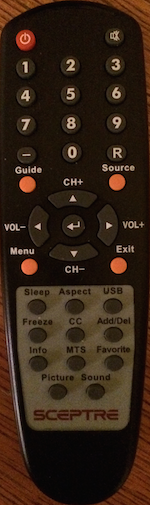
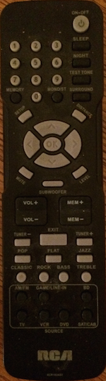
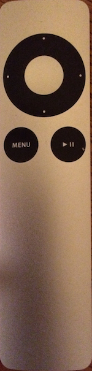

# Condo Television Setup

## Setup for TV:
### Regular Television (Cable / Satelite / whatever the hell it is)
* Step 1: Turn on the TV
* Step 2: Change the TV Source to "TV"

### Changing the Channel
* Just hit the up / down buttons (CH+ / CH-) on the TV Remote

## Apple TV
* Step 1: Turn on the TV (TV Remote)
* Step 2: Turn on the Apple TV (Apple TV Remote)
* Step 3: Turn on the Surround Sound System (Surround Sound Remote)
* Step 4: Change the TV Source to HDMI1
* Step 5: Change the Surround Sound Input Source to "BD"

## Remotes
### TV Remote

### Surround Sound Remote (RCA)

### Apple TV Remote

